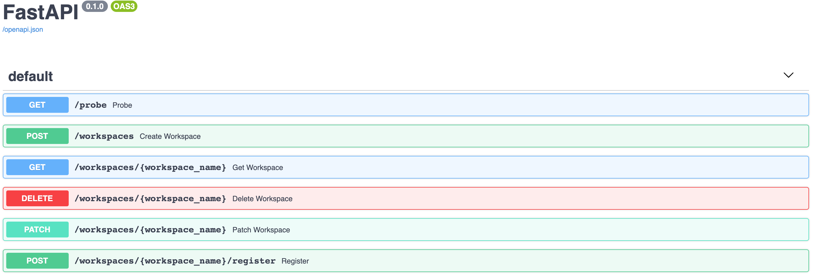

<br />
<p align="center">
  <a href="https://github.com/EOEPCA/rm-workspace-api">
    
  </a>

  <h3 align="center">EOEPCA Workspace API v2</h3>
  
  <p align="center">
    This repository includes the EOEPCA Workspace API component
    <br />
    <a href="https://github.com/EOEPCA/rm-workspace-api"><strong>Explore the docs »</strong></a>
    <br />
    <a href="https://github.com/EOEPCA/rm-workspace-api">View Demo</a>
    ·
    <a href="https://github.com/EOEPCA/rm-workspace-api/issues">Report Bug</a>
    ·
    <a href="https://github.com/EOEPCA/rm-workspace-api/issues">Request Feature</a>
  </p>
</p>

# Workspace API
<a name="introduction"></a>

The EOEPCA **Workspace API** is an HTTP interface that allows workspace teams onboarded to an EOEPCA based platform—as well as other connected EOEPCA Building Blocks—to retrieve detailed information about their individual workspace(s).

For version 2, the API is extended to expose additional status information for all fields defined in the Workspace Kubernetes Custom Resource (Workspace CR) of the respective team. The Workspace API also allows users to manage key workspace characteristics such as connected storage buckets and team members, either via API or (soon) via the UI. See the corresponding [Workspace CRD] 
(https://eoepca.readthedocs.io/projects/workspace/en/latest/api/workspace/) for the full API contract.

Additionally, the API enables platform operators to create new workspaces or delete existing ones.

> 💡 EOEPCA Workspace API v2 is currently in development and is scheduled for release in autumn 2025!

## Table of Contents
- [Key Features](#key-features)
- [Contributing](#contributing)
- [License](#license)

## Key Features
<a name="key-features"></a>

For a broader context, refer to the [Workspace BB](https://eoepca.readthedocs.io/projects/workspace), as the Workspace API serves as a thin layer on top, making workspace details more accessible to end users.

Some specific API details (mainly targeting v1 but still relvant) are outlined in the [Wiki Pages](https://github.com/EOEPCA/rm-workspace-api/wiki)

An OpenAPI specification is published as well — see [https://workspace-api.apx.develop.eoepca.org/docs](https://workspace-api.apx.develop.eoepca.org/docs)

[](https://workspace-api.apx.develop.eoepca.org/docs)

## Contributing
<a name="contributing"></a>

To use the Workspace API, you need to run it against a cluster with the Workspace Building Block installed. The easiest way to get started is by connecting to the `eoepca-demo` cluster with your `KUBECONFIG` set up accordingly:

```bash
python -m venv .venv && source .venv/bin/activate

pip install -r requirements.txt

KUBECONFIG=~/.kube/config-eoepca-demo HARBOR_URL="" HARBOR_ADMIN_USERNAME="" HARBOR_ADMIN_PASSWORD="" PREFIX_FOR_NAME="ws" WORKSPACE_SECRET_NAME="workspace" uvicorn --reload --host=0.0.0.0 --port 5000 --log-level=info --reload workspace_api:app
```

💡 Relevant VS Code configuration files are included to support a streamlined, opinionated development setup.

### ⚙️ Environment Variables

The backend behavior is influenced by the following environment variables. Set them in your shell or `.env` file

```python
# workspace_api/config.py
```

| Variable Name           | Default Value | Description                                                                                                                            |
| ----------------------- | ------------- |----------------------------------------------------------------------------------------------------------------------------------------|
| `PREFIX_FOR_NAME`       | `"ws"`        | Prefix used when generating internal Kubernetes workspace names from user input (e.g., `"ws-martin"`).                                 |
| `WORKSPACE_SECRET_NAME` | `"workspace"` | Name of the Kubernetes `Secret` expected per workspace for credentials (e.g., S3 access keys).                                         |
| `HARBOR_URL`            | `""` (empty)  | Optional URL to a Harbor container registry. Used if container registry secrets are managed.                                           |
| `HARBOR_ADMIN_USERNAME` | `""` (empty)  | Optional admin username for Harbor integration (if used).                                                                              |
| `HARBOR_ADMIN_PASSWORD` | `""` (empty)  | Optional admin password for Harbor integration (if used).                                                                              |
| `UI_MODE`               | `"no"`        | Set to `"ui"` to activate the Luigi frontend (shell + microfrontend SPA). Otherwise, only the API will be exposed.                     |
| `FRONTEND_URL`          | `"/ui"`       | Base URL for the frontend. Set to `http://localhost:9000` during development to load the Vue dev server instead of the built frontend. |


### Workspace UI

For version 2 a UI is included with the API bundle in the directory workspace_ui.   
This is a frontend for the Kubernetes-based workspace management application. It consists of two distinct parts:

- **Luigi Shell** — provides the micro frontend navigation and layout
- **Vue 3 App** — a single-page application (SPA) embedded via Luigi as a view, using Vue + Quasar.js

Both parts are served by a Python FastAPI backend.

> 💡 The UI bundle is still under active development and disabled by default. Use UI_MODE="ui" or url parameter `?devmode=true` to enable it.

#### Main UI Structure
```bash
.
├── workspace_api/                # Python FastAPI backend
└── workspace_ui/                 # Luigi shell + Vue frontend views
    ├── luigi-shell/
    │   └── public/                
    │        ├── index.html       # Luigi shell template (rendered by FastAPI)
    │        ├── logo.svg
    │        └── icons/                       
    ├── vue-app/                  # VueApp
    │   └── index.html            # Vue app entry point (used inside Luigi iframe)
    └── dist/                     # Built VueApp, served as static content
```

To build or update the UI distribution folder, run:
```bash
cd workspace_ui/vue-app

npm install
quasar build (or npm run build)
```

For frontend development:
```bash
cd workspace_ui/vue-app

quasar dev (or npm run dev)
```
Run the Workspace API with the FRONTEND_URL set to the dev server url, e.g. FRONTEND_URL="http://localhost:9000"

```bash
KUBECONFIG=~/.kube/config-eoepca-demo UI_MODE="ui" FRONTEND_URL=http://localhost:9000 uvicorn --reload --host=0.0.0.0 --port 5000 --log-level=info --reload workspace_api:app
```

---

If you're contributing, please base your work on the current `main` branch and rebase your changes before opening a pull request.

## License

[Apache 2.0](LICENSE) (Apache License Version 2.0, January 2004) from https://www.apache.org/licenses/LICENSE-2.0